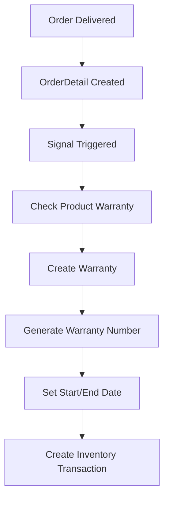
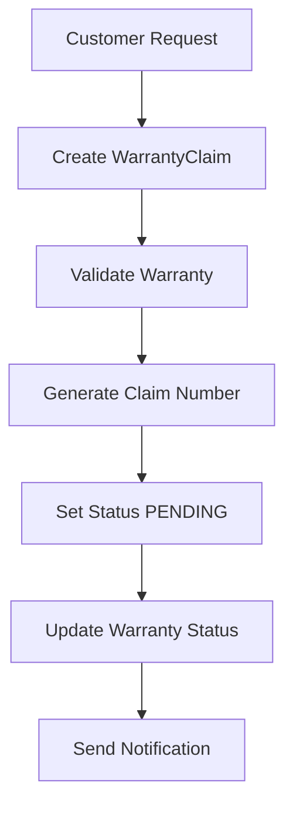
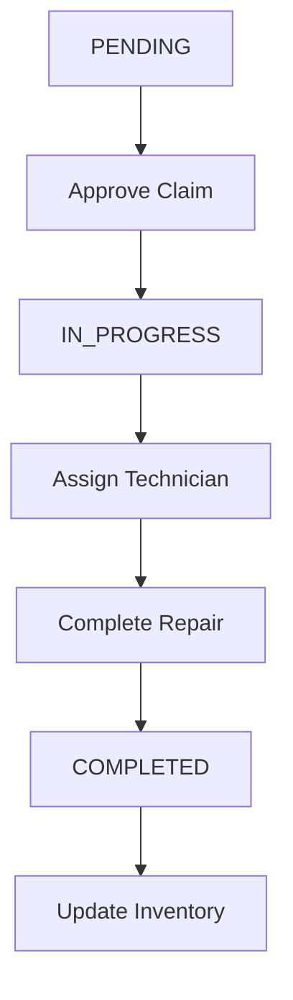

# Warranty Management Workflow

## Tổng quan

Hệ thống quản lý bảo hành được cải tiến với các tính năng tự động hóa và workflow rõ ràng.

## 1. Luồng Tạo Warranty

### 1.1 Tự động tạo từ Order


### 1.2 Thông tin Warranty
- **Warranty Number**: Tự động tạo theo format `W{order_id}-{product_id}-{warranty_id}`
- **Start Date**: Ngày đặt hàng
- **End Date**: Start Date + Product.warranty_period (tháng)
- **Status**: ACTIVE, EXPIRED, CLAIMED

### 1.3 Điều kiện tạo Warranty
- Order status phải là **'delivered'** (đã giao hàng)
- Sản phẩm phải có `warranty_period` > 0
- Warranty chưa tồn tại cho order detail này

### 1.4 Các trường hợp tạo Warranty
1. **Khi tạo OrderDetail mới** với order status = 'delivered'
2. **Khi thay đổi Order status** từ 'completed' sang 'delivered'
3. **Tự động tạo** cho tất cả OrderDetail của order khi status thay đổi

## 2. Luồng Warranty Claim

### 2.1 Tạo Claim


### 2.2 Xử lý Claim


### 2.3 Status Workflow
- **PENDING**: Chờ xử lý
- **IN_PROGRESS**: Đang xử lý
- **COMPLETED**: Hoàn thành
- **REJECTED**: Từ chối
- **CANCELLED**: Đã hủy

## 3. API Endpoints

### 3.1 Warranty Endpoints
```
GET /api/warranties/ - Danh sách warranty
GET /api/warranties/{id}/ - Chi tiết warranty
POST /api/warranties/ - Tạo warranty
PUT /api/warranties/{id}/ - Cập nhật warranty
DELETE /api/warranties/{id}/ - Xóa warranty

# Custom Actions
GET /api/warranties/statistics/ - Thống kê
GET /api/warranties/active_warranties/ - Warranty còn hiệu lực
GET /api/warranties/expired_warranties/ - Warranty hết hạn
POST /api/warranties/{id}/extend_warranty/ - Gia hạn
GET /api/warranties/{id}/remaining_days/ - Số ngày còn lại
POST /api/warranties/{id}/create_claim/ - Tạo claim
```

### 3.2 Warranty Claim Endpoints
```
GET /api/claims/ - Danh sách claims
GET /api/claims/{id}/ - Chi tiết claim
POST /api/claims/ - Tạo claim
PUT /api/claims/{id}/ - Cập nhật claim
DELETE /api/claims/{id}/ - Xóa claim

# Custom Actions
GET /api/claims/statistics/ - Thống kê
GET /api/claims/pending_claims/ - Claims chờ xử lý
GET /api/claims/overdue_claims/ - Claims quá hạn
POST /api/claims/{id}/approve_claim/ - Duyệt claim
POST /api/claims/{id}/complete_claim/ - Hoàn thành claim
POST /api/claims/{id}/reject_claim/ - Từ chối claim
GET /api/claims/{id}/processing_days/ - Số ngày xử lý
POST /api/claims/{id}/assign_technician/ - Gán technician
```

## 4. Service Layer

### 4.1 WarrantyService
```python
# Tạo warranty từ order
WarrantyService.create_warranty_from_order(order_detail, user)

# Xử lý warranty claim
WarrantyService.process_warranty_claim(claim, action, user)

# Lấy thống kê
WarrantyService.get_warranty_statistics()
```

### 4.2 Inventory Integration
- Tự động tạo inventory transaction khi tạo warranty
- Trừ kho khi có warranty claim
- Cộng kho khi hoàn thành warranty

## 5. Automation

### 5.1 Signals
- Tự động tạo warranty khi order hoàn thành
- Tự động cập nhật warranty status
- Gửi thông báo khi có claim mới
- Kiểm tra claims quá hạn

### 5.2 Management Commands
```bash
# Cập nhật warranty status
python manage.py update_warranty_status --update-expired

# Kiểm tra claims quá hạn
python manage.py update_warranty_status --check-overdue

# Thực hiện cả hai
python manage.py update_warranty_status
```

## 6. Validation Rules

### 6.1 Warranty Validation
- Warranty end date phải sau start date
- End date phải tính theo product warranty period
- Không thể tạo warranty cho sản phẩm không có warranty period

### 6.2 Claim Validation
- Chỉ có thể tạo claim cho warranty còn hiệu lực
- Claim date không được trước warranty start date
- Completed date không được trước claim date

## 7. Business Rules

### 7.1 Warranty Period
- Tính theo tháng từ product.warranty_period
- Có thể gia hạn thêm ngày
- Tự động cập nhật status khi hết hạn

### 7.2 Claim Processing
- Mặc định 7 ngày để hoàn thành
- Có thể gán technician
- Tracking số ngày xử lý và quá hạn

### 7.3 Inventory Management
- Tự động trừ kho khi approve claim
- Tự động cộng kho khi complete claim
- Tracking tất cả transactions

## 8. Monitoring & Alerts

### 8.1 Overdue Claims
- Tự động phát hiện claims quá hạn
- Gửi cảnh báo cho manager
- Tracking processing time

### 8.2 Expired Warranties
- Tự động cập nhật status
- Thống kê số lượng warranty hết hạn
- Báo cáo định kỳ

## 9. Performance Optimization

### 9.1 Database Indexes
- warranty_number
- status
- warranty_start_date
- warranty_end_date
- claim_number
- claim_date

### 9.2 Caching
- Warranty status
- Claim statistics
- Product warranty information

## 10. Security

### 10.1 Permissions
- StoreEmployee: Xem danh sách, tạo claim
- SuperUser: Tất cả quyền
- Custom permissions cho từng action

### 10.2 Audit Trail
- Tracking tất cả changes
- Log user actions
- Backup warranty data 